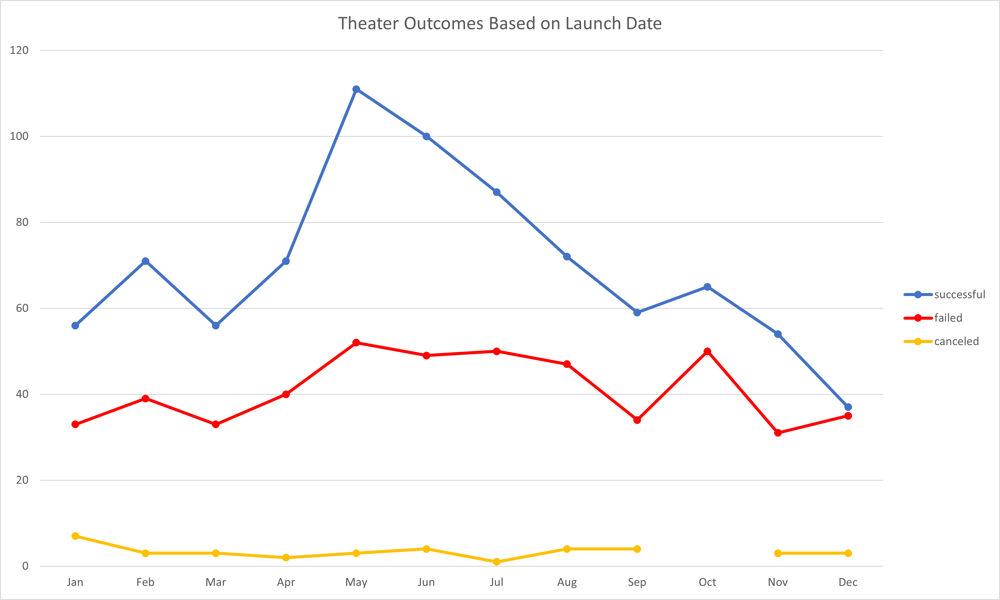
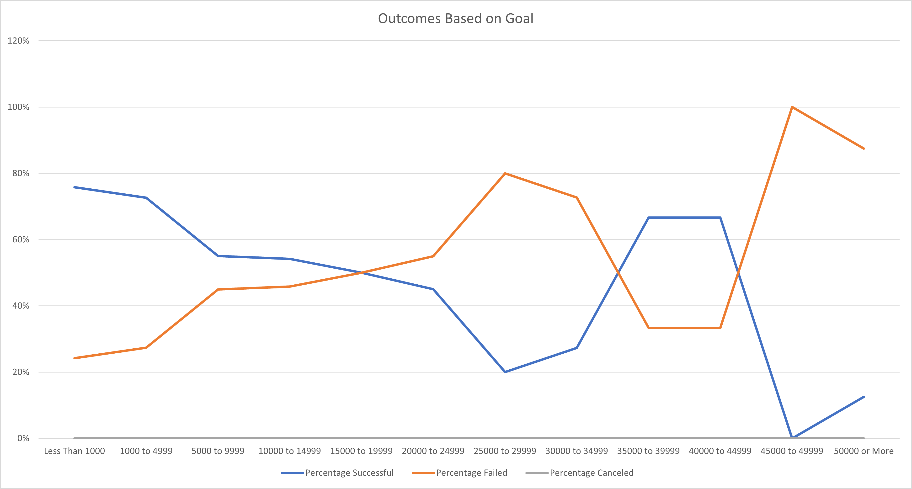

# **Kickstarting with Excel**

## **Overview of Project**

### **Purpose**
Analyze kickstarter data to identify how different campaigns fared in realation to their launch dates and funding goals.

## **Analysis and Challenges**

### -Analysis of Outcomes Based on Launch Date
A new column was created in the "Kickstarter" sheet called "Years" that used the [YEAR()](https://support.microsoft.com/en-us/office/year-function-c64f017a-1354-490d-981f-578e8ec8d3b9) excel formula to extract only the year from the launch date. This provided an additional filter that would allow us to filter the data based on solely the year. A new [pivot table](https://support.microsoft.com/en-us/office/create-a-pivottable-to-analyze-worksheet-data-a9a84538-bfe9-40a9-a8e9-f99134456576) was then created using the now updated Kickstarter table. The pivot table was set up such that the count of kickstarters could be seen broken down by month and outcome for records with a parent category of theater. A chart was then created from the resulting pivot table (See Figure 1). For conclusions drawn from this anlysis see the [Results](#results) section below.
 
 

Figure 1

 

### -Analysis of Outcomes Based on Goals
A new sheet was created and a table formed to identify the number/percentage of kickstarters that were succesful, failed or cenceled based on different goal ranges. To achieve this, use of the [COUNTIFS()](https://support.microsoft.com/en-us/office/countifs-function-dda3dc6e-f74e-4aee-88bc-aa8c2a866842) excel formula was leveraged to pull in the correct information to our new table. Once the information was pulled in, a chart was created plotting the percentage of outcomes based on the different goal ranges (See Figure 2). For conclusions drawn from this anlysis see the [Results](#results) section below.
 
 

Figure 2

 

### -Challenges and Difficulties Encountered
No challenges or difficulties were encountered during production of this project. However, if I had to note one area where a challenge may be encountered, it would be when setting the grouping of launch date in the "Theater Outcomes by Launch Date" pivot table by only month.

## **Results**

- What are two conclusions you can draw about the Outcomes based on Launch Date?
   - May is the month with the most successful launches for theater kickstarters.
   - October is the month with the most failed launches for theater kickstarters.
 
 

- What can you conclude about the Outcomes based on Goals?
    - No kickstarter under the "plays" category that has received any amount of funding has been canceled.
    - As the goal increases, the percentage of succesful kickstarters trends downward and the percentage of failed kickstarters trends upwards.
 
 

- What are some limitations of this dataset?
    - The data may not be representative of the entire population for kickstarter data.
    - Outliers have not been searched for and addressed. This may skew the data.
 
 

- What are some other possible tables and/or graphs that we could create?
    - Stacked column chart for number of successful, failed, and canceled kickstarters by goal range.
    - Pivot table and line chart breaking down further Theater Outcomes Based on Launch Date by subcategory.
